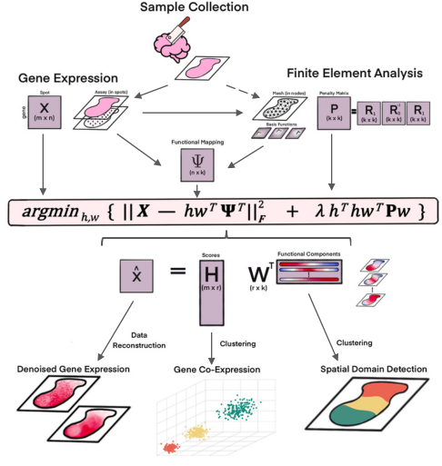
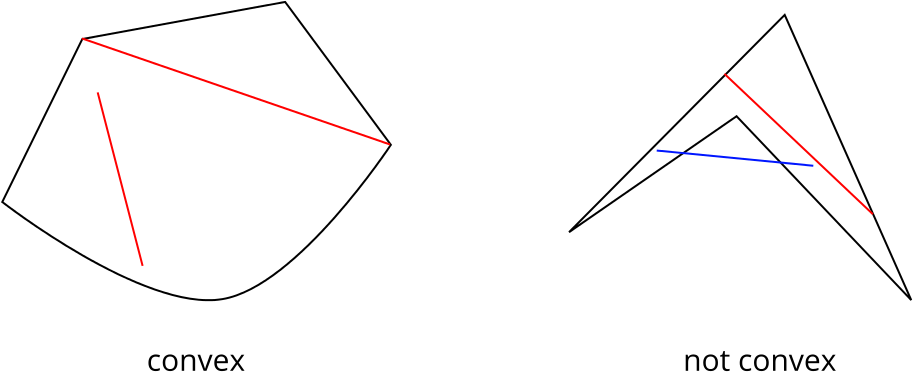

# fPCA for Spatial Transcriptomics

Functional Principal Component Analysis (fPCA) is a fast, accurate workflow for spatial domain detection in spatial transcriptomics that models gene expression as smooth functions over a finite-element mesh—preserving complex tissue geometry (holes, non-convexities) and true spatial relationships. 
 
Compared with leading methods, fPCA runs substantially faster, achieves higher accuracy which was tested with simulated datasets with known ground truth.

It also provides inherent high-resolution reconstructions and scales to dense, high-coverage assays; results are demonstrated on HER2+ breast cancer, human DLPFC, and mouse cerebellum. 
 



A non-convex shape is one that in which at least there exists a pair of points in which a straight line segment between them is contained completely within the shape itself. In the example below, the red lines satisfy this property while the blue line does not, indicating the right shape is non-convex.


Photo adapted from https://undergroundmathematics.org/glossary/convex-shape


## Tutorials

Tutorials created by Marco Galliani (acknowledged in manuscript)
- [fPCA 2D Tutorial (code on GitHub)](https://github.com/Drew4495/ST-lens/blob/main/Tutorials/fPCA_2D.html)  
- [fPCA 2D Tutorial (rendered)](https://htmlpreview.github.io/?https://raw.githubusercontent.com/Drew4495/ST-lens/main/Tutorials/fPCA_2D.html)


## Manuscript scripts

- Talk about manuscript (in review). Breifly talk about 3 different tissues
- For full scripts that recreated the manuscript, see additional readme.md in ???? and the scripts in 


TEMPLATE
# Foobar

Foobar is a Python library for dealing with word pluralization.

## Installation

Use the package manager [pip](https://pip.pypa.io/en/stable/) to install foobar.

```bash
pip install foobar
```

## Usage

```python
import foobar

# returns 'words'
foobar.pluralize('word')

# returns 'geese'
foobar.pluralize('goose')

# returns 'phenomenon'
foobar.singularize('phenomena')
```

## Contributing

Pull requests are welcome. For major changes, please open an issue first
to discuss what you would like to change.

Please make sure to update tests as appropriate.

## License

[MIT](https://choosealicense.com/licenses/mit/)
